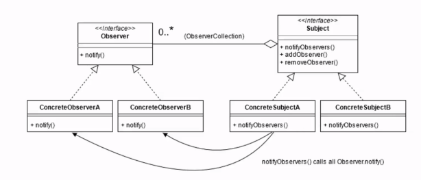
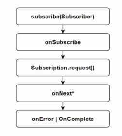

# 响应式编程

## 基本概念和规范

### 1. 事件驱动
> 观察者模式, 基于事件的发布订阅
>


### 2. 响应式编程的特点
> 异步代码编排

### 3. 响应式流JVM规范
> 响应式流JVM规范
https://github.com/reactive-streams/reactive-streams-jvm
> 
> 由NetFlix -RxJava ,Pivotal - Reactor , RedHat - Vert.x联合制定

#### 3.1 基本原则
* 处理任意数量的元素
* 按序处理
* 异步传递元素
* 非阻塞的回压
  > 什么是回压？
  > 
  > 发布者绝不阻塞，订阅者按需拉取，所有缓冲都有界
  > Subscriber 通过 Subscription.request(n) 告诉上游“我只要 n 个元素”。
  > Publisher 任何时候发送的数据 ≤ 已请求数量，从而下游决定速率。
  > 如果下游不再 request，上游必须异步、非阻塞地等待，不能主动溢写无界队列

  > 回压处理策略
  > 
  > 在出现下游跟不上时，提供了 5 种常用的回压处理策略（都是 Publisher 端的补救手段，而不是规范本身的一部分）
  > Missing 报错，Error 挂掉，Buffer 缓存，Drop 丢旧，Latest 留新。
  * **Missing（无任何策略）**：直接报错：MissingBackpressureException。用于开发阶段暴露背压问题，生产环境几乎不用。
  * **Error（立即失败）**：发现下游队列溢出就立即向 Subscriber 发送 onError，让整条流快速失败。适合“少量数据也不能丢”的场景。
  * **Buffer（默认策略）**：把来不及消费的元素放进有界缓冲（如 256）。缓冲满后才会触发回压。既保留数据，又不会无界增长，是日常默认。
  * **Drop: 丢弃**：缓冲满后直接丢弃最早的元素，腾出空间给新数据。适合“只关心最新”的监控或日志场景。
  * **Latest: 最近**：缓冲满后只保留最新一条，其余全部丢弃。下游总能拿到“最近一个”值，常用于 UI 或实时仪表盘。


### 4. 定义的接口类

1. Publisher
> 事件发布者
>
> 发送onNext信号次数不得超过订阅者请求的元素个数,
> 如果进程失败，需要调用onError告知订阅者,
> Publisher.subscribe()内部需调用onSubscribe(Subscriber s),
> 允许同时存在多个订阅者.


* 主要接口
    ```java
    void subscribe(Subscriber<? super T> s);//创建并绑定一个新的订阅关系
    ```

2. Subscriber
> 事件订阅者
>

* 主要接口
    ```java
    void onSubscribe(Subscription s);   // 收到订阅令牌
    void onNext(T t);                   // 收到一个数据
    void onError(Throwable t);          // 收到异常
    void onComplete();                  // 收到结束信号
    ```


3. Subscription
> 一次订阅关系，做流量协商
>
> 需要调用Subscriptions.request(long n)来想发布者请求数据,
> 限制调用onComplete或onError 方法
> 只能存在一个活跃的订阅,
> 调用Subscription.cancel()之后仍有onNext信号发送.
>
> 需在当前订阅者的上文中被调用,Subscription.request(long n) 最多请求2^63-1个元素


* 主要接口
    ```java
    void request(long n);   // 向上游要 n 个元素（回压）
    void cancel();          // 不再接收，上游可以清资源
    ```

4. Processor
> 既是订阅者又是发布者
> 
> 聚合类

```java
public interface Processor<T, R>
        extends Subscriber<T>, Publisher<R> {
    // 没有额外方法
}
```

### 5. 总体流程 

1. 绑定事件订阅关系， 执行1次：
    ```java
    Publisher.subscribe(Subscriber)
    ```

2. 回调订阅关系建立：
    ```java
    publisher.subscribe(Subscriber sub) {
       ……
       sub.onSubscribe(subscription)
    }
    ```
   
3. 订阅者主动请求消费：
    ```java
    subscriber.subscribe(Subscription sub) {
        ……
        sub.request(n);//请求消费n次
    }
    ```

4. publisher触发 0-n次 Subscriber.onNext()

5. publisher触发 0-1次 Subscriber.onError()/.onComplete()




